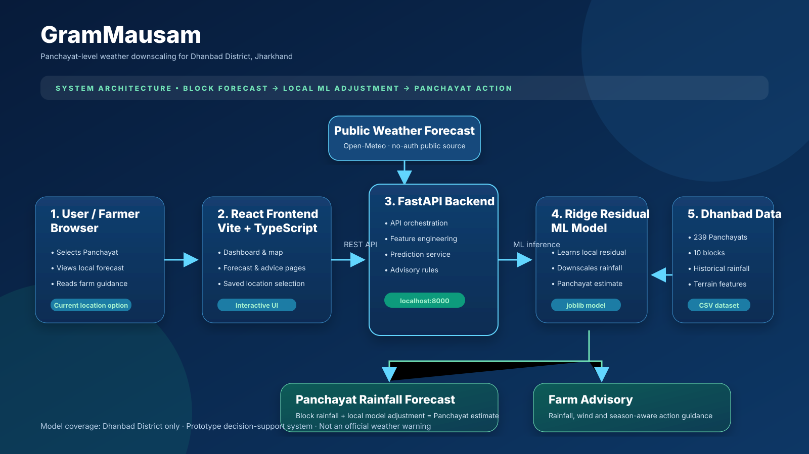
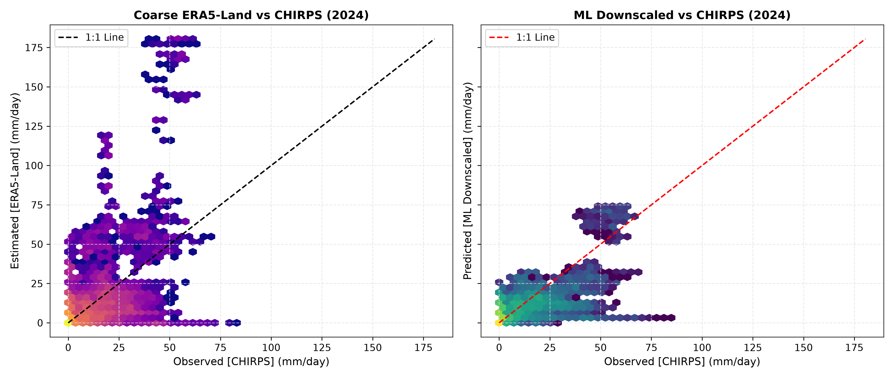
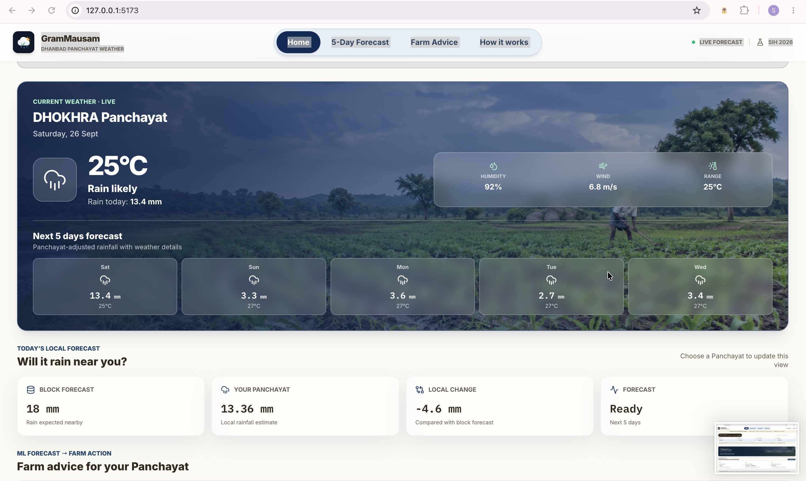
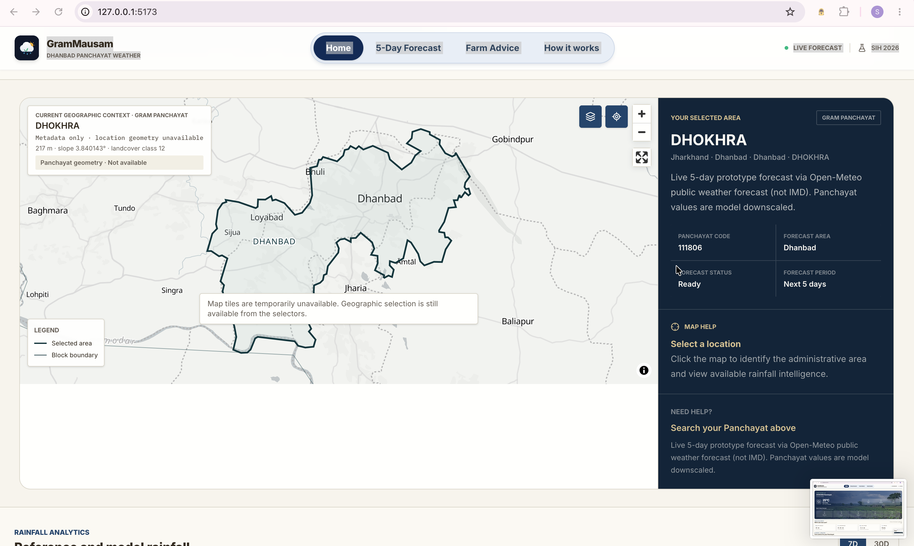
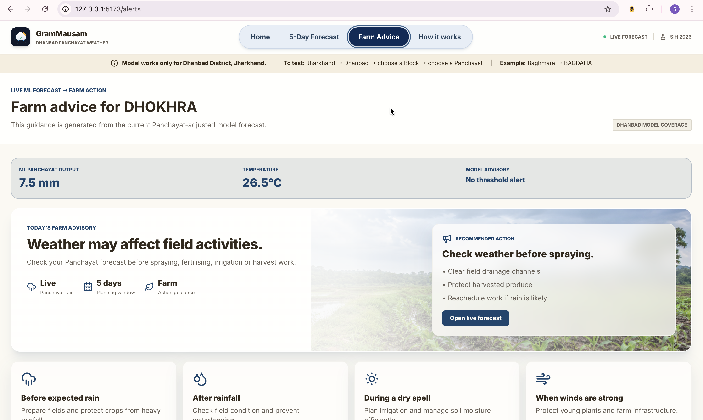

# GramMausam

<p align="center">
  
</p>

<p align="center"><strong>Panchayat-level rainfall intelligence for Dhanbad District, Jharkhand</strong></p>

GramMausam is an end-to-end prototype for the SIH problem statement: **downscaling weather forecasts from Block level to Panchayat level for agro-meteorological advisory services**. It turns a coarse rainfall forecast into a Panchayat-level estimate, explains the local adjustment, and presents forecast-driven farm guidance in a simple web dashboard.

> **Current coverage:** the trained model is for **Dhanbad District, Jharkhand only**. It supports 237 Panchayats with complete supervised rainfall targets. It is not an official weather warning system.

## Problem-to-solution fit

| SIH requirement | GramMausam implementation |
| --- | --- |
| Block-level forecast to Panchayat-level information | Ridge Residual ML model adjusts the block/reference rainfall for the selected Panchayat. |
| High-resolution local variables | Terrain, slope, land-cover, temperature, humidity, wind, ET, seasonality, and coarse rainfall features. |
| Agro-meteorological advisory | Forecast-driven prototype guidance for rain, dry spell, wind, drainage, irrigation, and spraying decisions. |
| Usable by non-technical people | Location selectors, plain-language explanation, five-day cards, visual model flow, and farmer-oriented interface. |
| Transparent model output | The dashboard shows block forecast → ML local adjustment → Panchayat estimate, and labels the model as Ridge Residual. |

## Architecture



### End-to-end flow

```text
Public forecast source / operational input
              │
              ▼
       Block-level weather features
              │
              ▼
  FastAPI feature engineering service
  (seasonality + terrain + weather data)
              │
              ▼
  Ridge Residual downscaling model
              │
              ▼
  Panchayat rainfall estimate + rule-based farm advice
              │
              ▼
 React / Vite GramMausam dashboard
```

### Components

| Layer | Technology / asset | Responsibility |
| --- | --- | --- |
| Web application | React, TypeScript, Vite | Panchayat selection, forecast visualisation, maps, advice, blogs, and methodology screens. |
| API | FastAPI + Pandas + scikit-learn | Loads the trained model, creates features, serves Panchayat data, and returns predictions. |
| ML inference | `Ridge_residual.joblib` | Estimates the correction to a coarse rainfall input. |
| Historical labels | CHIRPS daily precipitation | Panchayat-level rainfall target used for supervised training and evaluation. |
| Coarse reference | ERA5-Land daily precipitation | Baseline/reference rainfall used by the historical experiment. |
| Live prototype input | Open-Meteo public forecast | No-auth public forecast used in the prototype; explicitly labelled **not IMD**. |
| Geography | LGD-derived project metadata and block geometry | Location hierarchy and Dhanbad Panchayat context. |

## ML model

### Selected model: Standardized Ridge Residual Regression

The selected model is **Ridge Residual**: a regularised linear regression model with `StandardScaler` and `Ridge(alpha=10.0, random_state=42)`.

Instead of predicting rainfall from scratch, it learns the local error in the coarse forecast:

```text
residual = observed CHIRPS rainfall − coarse ERA5-Land rainfall
predicted Panchayat rainfall = max(0, coarse rainfall + predicted residual)
```

This makes the downscaling result easy to explain in the interface: the user sees the reference/block rainfall, the local ML adjustment, and the resulting Panchayat rainfall estimate.

### Model inputs

| Dynamic weather | Local / static | Time and reference features |
| --- | --- | --- |
| Temperature, humidity, wind, evapotranspiration | Elevation, slope, land-cover class | Month, day-of-year, sine/cosine seasonality, monsoon flag, reference rainfall, log-reference rainfall, rain-event flag |

### Model artifact and source code

- Trained selected model: [`ml/models/Ridge_residual.joblib`](ml/models/Ridge_residual.joblib)
- Model training: [`ml/src/train.py`](ml/src/train.py)
- Feature engineering: [`ml/src/features.py`](ml/src/features.py)
- Spatial holdout evaluation: [`ml/src/generalization.py`](ml/src/generalization.py)
- API inference: [`backend/main.py`](backend/main.py)

## Dataset and evaluation protocol

| Item | Value |
| --- | --- |
| Historical dataset | `master_dataset_v2.csv` |
| Records | 436,653 daily rows |
| Time period | 1 Jan 2020 – 31 Dec 2024 |
| Geographic scope | Dhanbad District, 10 Blocks, 239 Panchayats in metadata |
| Modelled Panchayats | 237 (two Panchayats have no rainfall target rows) |
| Training period | 2020–2022, 259,752 rows |
| Model-selection validation | 2023, 86,505 rows |
| Untouched final test | 2024, 86,742 rows |
| Rainfall target | CHIRPS daily precipitation |
| Historical coarse reference | ERA5-Land daily precipitation |

The final 2024 year was not used in fitting or model selection. In addition, a spatial transfer experiment withholds **Tundi and Topchanchi** during training to test performance in geographically unseen blocks.

## Benchmarks

### Validation model selection — 2023

The candidate models included direct and residual variants of Ridge, Random Forest, XGBoost, and LightGBM. The selected Ridge Residual achieved the lowest validation RMSE.

| Model | Validation RMSE (mm/day) | Validation MAE (mm/day) | R² |
| --- | ---: | ---: | ---: |
| **Ridge Residual — selected** | **6.5444** | 3.5337 | **0.3986** |
| Ridge Direct | 6.5445 | 3.5337 | 0.3986 |
| LightGBM Direct | 6.7366 | **3.4345** | 0.3627 |
| Coarse ERA5 baseline | 6.8120 | 2.9266 | 0.3484 |
| XGBoost Residual | 7.0543 | 3.5718 | 0.3012 |
| Random Forest Direct | 7.2090 | 3.6371 | 0.2702 |
| Historical climatology baseline | 8.6333 | 4.5318 | -0.0466 |

### Untouched 2024 test benchmark

| Method | RMSE (mm/day) ↓ | MAE (mm/day) ↓ | R² ↑ | Correlation ↑ |
| --- | ---: | ---: | ---: | ---: |
| Coarse ERA5 baseline | 10.2224 | 3.7499 | -0.4250 | 0.5940 |
| Historical climatology | 8.4695 | 4.5654 | 0.0218 | 0.3754 |
| **Ridge Residual — selected** | **6.6698** | **3.7483** | **0.3934** | **0.6500** |
| Ridge Direct | 6.6697 | 3.7482 | 0.3934 | 0.6500 |
| LightGBM Direct | 7.6432 | 4.0976 | 0.2034 | 0.5253 |
| Random Forest Residual | 7.9902 | 4.0619 | 0.1294 | 0.5864 |
| XGBoost Direct | 8.1404 | 4.2639 | 0.0964 | 0.4882 |

**Result:** compared with the historical coarse ERA5 baseline, Ridge Residual reduces RMSE from **10.22 to 6.67 mm/day** — a **34.8% reduction in error**.

### Spatial generalisation: unseen blocks

The model was trained without Tundi and Topchanchi, then evaluated on their 2024 records.

| Held-out test | Panchayats | Records | ERA5 RMSE | Ridge Residual RMSE | Improvement | R² |
| --- | ---: | ---: | ---: | ---: | ---: | ---: |
| Tundi + Topchanchi | 42 | 15,372 | 8.9801 | **6.3920** | **2.5881 mm/day** | 0.3948 |

### Panchayat-level evidence

- **237 / 237 modeled Panchayats** improved in RMSE against the ERA5 baseline.
- Median Panchayat RMSE improvement: **3.5965 mm/day**.
- Mean Panchayat RMSE improvement: **3.5184 mm/day**.
- Improvement range: **1.6702 to 4.4982 mm/day**.



All detailed metrics are available in [`ml/results/metrics_summary.csv`](ml/results/metrics_summary.csv), with Panchayat-level results in [`ml/results/panchayat_metrics.csv`](ml/results/panchayat_metrics.csv) and reproducibility metadata in [`ml/results/experiment_metadata.json`](ml/results/experiment_metadata.json).

## Run locally

### 1. Start the backend

```bash
cd backend
python3 -m venv .venv
source .venv/bin/activate
pip install -r requirements.txt
uvicorn main:app --host 127.0.0.1 --port 8000 --reload
```

API health check: <http://127.0.0.1:8000/health>

### 2. Start the frontend

```bash
cd frontend/geo-monsoon-pulse
bun install
bun run dev
```

Open <http://127.0.0.1:5173>. To see actual ML downscaling output, choose:

```text
Jharkhand → Dhanbad → a Block → a Panchayat
Example: Baghmara → BAGDAHA
```

## API overview

| Endpoint | Purpose |
| --- | --- |
| `GET /health` | Confirms API, model, and Panchayat catalogue availability. |
| `GET /panchayats/{gpcode}/forecast` | Returns the five-day Panchayat downscaled forecast. |
| `POST /predict` | Produces one prediction from supplied weather input values. |
| `GET /current-weather` | Returns visitor-location public weather context; this is not downscaled. |

## Responsible-use notes

- This is a **Dhanbad-only prototype** trained on historical data; do not present it as pan-India coverage.
- Live prototype values use Open-Meteo, not IMD. Replacing that input with authorised IMD/NWP forecast feeds is required for operational use.
- Advisory messages are decision-support prototypes. Crop-stage recommendations require validation by KVK/agricultural experts before farmer deployment.
- Continuous rainfall error is substantially improved, but extreme convective rainfall and trace-rain false alarms remain an important limitation to address with an operational two-stage event + regression model.

## Interface gallery

The dashboard guides a user through State → District → Block → Panchayat selection, then displays a five-day downscaled forecast, the model adjustment, local weather context, farm actions, maps, and agricultural guides.

### Panchayat selection and visible ML downscaling output


### Live Panchayat weather and five-day downscaled forecast



### Interactive Dhanbad location context



### Dedicated five-day forecast screen


### Forecast-driven farm advisory screen



## Team

**TEAM_AAGAZ · Silicon University**
SIH 2026 · Dhanbad, Jharkhand coverage
